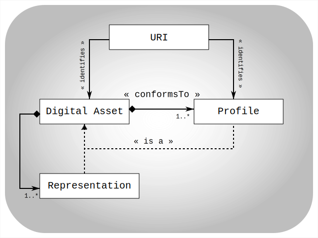

# Radical Transparency through conformity-profile declarations

## Core idea

The paradox to interoperability is this: to be able to establish any interoperability we need (as a minimum) a definitive way to detect the inverse: mismatches, lack of compatibility, instances of non-conformance, areas of non-interoperability.

<ins>The proposal of radical transparency is therefore simply</ins>:
<center>
*every digital asset needs to declare (i.e. have known)*
*the «PROFILE(s)» it conforms to.*
</center>

Left to cover are then
* What is a PROFILE?
* How does a PROFILE materialize itself?
* How do we declare conformity? What is the model?
* How can conformity declarations be harvested (federation?) 

## What is a «Profile» (and what is it not)

Essentially a profile is a conceptual entity that embodies (captures) all guaranteed expectations one can have on a digital asset that allows practical and effective use of it.

Note: digital assets include mediafiles, papers, documents, datasets, webservices, fragments or subsets, … but also concepts, standards and (as we will see) profiles itself.

This makes "a profile" very much like "a standard" but still escapes that spontaneous interpretation in a number of important ways:

* while standard is typically associated to one specific technical aspect;
<ins>a profile</ins> is likely to combine a number of them to achieve a higher level of usability.
* while standards typically aim for broad applicability through variables, options and actual free payload;
<ins>a profile</ins> is likely to narrow this further down, again aiming to increase the level of agreement, guaranteed certainties, and actual usage.

## How does a «Profile» manifest itself?
### @LVL∅. a «Profile» is identifyable

The primary use case for having profiles is comparing their identifiers to detect, check, assess assumed/expected compatibility (or lack thereof).  To do this we simply need unambiguous identifiers for them.

In essence we could almost state that a profile is indeed its identifier. (Meaning, it is in fact sufficient to have nothing more for the prime use case: to declare and detect conformity).

Since all relevant practical use is on the web we claim these identifiers are simply URI (best following the recommendations in [coolURIs](https://www.w3.org/TR/cooluris/))

We explicitly stress this level 0 as the required core. Nothing more. This to make this as achievable as possible.

### @LVL1. a «Profile» is self describing. 

Still. Better than only identifiers profiles should be (or have, or link to) digital assets that describe the usage expectations the profile stands for (or 'contains’) 

At least, these descriptions should be consumable by humans.

### @LVL2. a «Profile» is machine actionable

Ideally the profiles are digital assets that have (at least one) representation that can be processed and interpreted by machines.  These representations are to support a multitude of different use cases:
* formally and independently assess or validate actual conformance
* refer and aggregate used standards & profiles
* allow profiling composed complex digital assets with sub-assets
* declare chosen options within applied standards
* refer to software capable of processing any conforming digital assets
* ... etc etc

Going meta, it is important that we (at this stage) do not need, do not enforce, do not even suggest any schema, format, or protocol for such LVL 2 profile descriptors.  This is because (1) we do not need it and (2) realise that multiple alternatives will need to exist to handle the open list of potential processing needs and use cases.

The only observation we need at this stage is that, from LVL1 profiles are digital assets in their own right, this allows applying the profile-declaration technique onto itself.

So to be clear: as of LVL2 we assume the profile identifier (i.e. its URI) has itself a conformity-declaration that describes to which meta-profile it conforms to. This should guide and guarantee how it can be processed and be activated.

## How do we declare a «Profile»?  (How is it modeled, how do we store it?)

The core model behind this is deliberately kept as minimal as possible. Its core elements are:
* URI are used to identify Digital Assets and Profiles
* Digital assets declare conformity to a Profile
* A Profile can be (preferably) a digital asset in their own right

Additionally, not essential, but allowing for more flexibility, and fitting the actual webmodel reality:
* Digital Assets can have multiple representations associated
* In some cases these are (can be considered) Digital Assets in their own right

This leads to this simple model:


This core model can obviously be implemented in many actual repository or catalog systems, or be expressed in a knowledge graph.

### RDF Implementation

The agreed way to capture this declaration is through the simple triple:
```triple
@prefix dct: <http://purl.org/dc/terms/>.
<digital-asset-uri> dct:conformsTo <profile-uri> .
```

### Classic Related Tables Implementation

Just making the case, this could simple be captured through having these columns / fields:
* table `assets` with at least `@id` holding its uri (or something that expands into that)
* table `profiles` with at least `@id` holding its uri (or something that expands into that)
* table `conformity-declarations` with at least the association between `asset.@id` and `profile.@id`

## How can this be harvested?

In essence the above (core model, technical declaration, exposure and storage) does suffice.  However,  this section will explicitly show how existing web standards and technologies allow us to express and harvest this information.

This should not be seen as only “an optional exercise”, but a fundamental one. In order to build an efficient and effective distributed (or federated) and thus scalable architecture the self-authoring of these declarations is instrumental to its success. (Without exaggeration it is to be compared to how the unhindered creation of individual websites contributes to the global success of the web experience)

The goal to achieve is this:
* given a digital-asset-URI
* how can we find a harvest its conformsTo declarations?

We technically extend this slightly to a more “generic goal”
* given a digital-asset-URI
* how can we find all associated descriptions and metadata
* parse them, in order to discover any conformsTo declarations.

The plan, strategy, procedure to achieve this, should follow these steps:

### Step 1. grab DIRECT declarations
⇒ use HTTP-GET or HTTP-HEAD to discover header:  (see [RFC 6906](https://datatracker.ietf.org/doc/html/rfc6906))

eiter:

> `Link: <profile-uri>, rel="profile"`

or:

> `Link: <profile-uri>, rel="http://purl.org/dc/terms/conformsTo"`

### Step 2 grab INDIRECT declarations via associated descriptions

⇒ use `HTTP-GET` or `HTTP-HEAD` to find associated descriptions via one of: content-negotiation, linksets, external descriptions, html pages 

#### 2a. Content-Negotiation

Apply content-negotaion on the uri of the digital asset in search of some RDF serialization format that should hold the conformity-declaration-triple mentioned above

#### 2b. linksets

[RFC 9264](https://datatracker.ietf.org/doc/html/rfc9264) describes how links to associated digital assets can be encoded and followed.  These in turn can contain direct declarations as above, or indirect ones, as below. It also allows hints about content-negotiation headers to apply.

#### 2c. signposting

[signposting.org](https://signposting.org/) describes how to use an explicit Link with rel=describedby to defer to one or more associated metadata formats.  These should be fetched and inspected to discover encoded conformity declarations.

At minimum we recommend at least an RDF description format that holds the straightforward conformity-declaration-triple mentioned above.

#### 2d. html embedding

Linking up with LVL1 (human oriented profile descriptions) the harvesting should also accept returned text/html pages and parse those in search of either / both 

1. html-head-link-meta tags towards direct profiles, linksets, signposting as mentioned above
2. embedded RDF through script tags with RDF in json-ld or turtle

### Step 3 fallback to host inspection for any available asset-description-services

Finally. If all of the above fails, there is another road to follow. 

* From the asset-uri we can derive its serving host → i.e. the `http://hostame.domain/` root-variant of that url
* From the it can (should) have a `robots.txt` exposed that declares a `sitemap.xml`
* This in turn should list a number of resources and services to regularly check
  * Note: We could also organise for the introduction of a `/.well-known/path` (see [RFC 8615](https://datatracker.ietf.org/doc/html/rfc8615)). However, this would be adding assumptions and new standards, and we don’t really need it.
* The listed resources there should be inspected in search of (a) catalogs, (b) catalog feeds, or(c) catalog inspection services
  * caveat: applying our own logic rigorously this assumes these can be processed and recognised based on their «Profle»  which allows to declare how to consume them in search for the actual thing we are still looking for: i.e. the conformsTo of the original digital-asset-uri
  * in fairness: this will make this only workable in some next phase of this.


