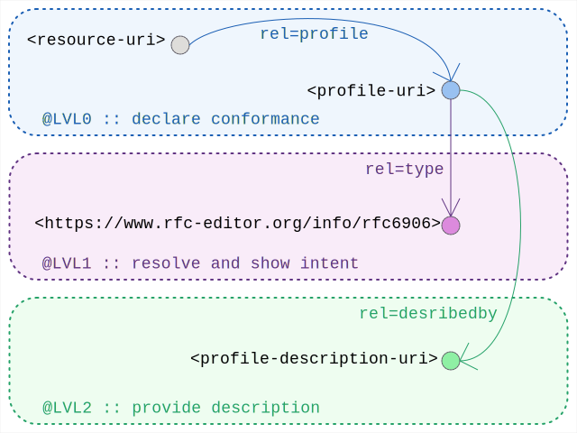

# Linkset Usage Pattern: Profile Conformity Declarations

## Pattern Name

[Profile Conformity Declaration][RT-P01]

## Goal

The objective of this design pattern is to resolve the "interoperability paradox" by mandating a mechanism for the definitive, automated detection of non-interoperability. To establish reliable data exchange, systems must first possess the capacity to detect mismatches, compatibility gaps, and non-conformance. This pattern enforces a model of "Radical Transparency," where the explicit exposure of declared conformity-to-profile serves as the foundational prerequisite for establishing verified, multi-layered compatibility across heterogeneous digital ecosystems.

## Motivation

The requirement for interoperability transcends simple data exchange; it necessitates a structured alignment of technical expectations. In architectural practice, this is best understood through the lens of layered requirements.

> **The OSI-Stack Analogy**: This kind of declaration should be viewed as a logical extension of the tiered approach laid down by the OSI (Open Systems Interconnection) model. There, lower-layer protocol-headers are consistently declaring the nature of their payload, this unambigously activating the correct next-layer protocol. While HTTP continues to follow that pattern through its Content-Type header, that practice actually assumes it fits its role of being the final presentation-layer, directly serving human consumption.  This assumption fails to take into account the contemporary reality: HTTP has become an application delivery platform, is tunneling even higher layer APIs like a true transport layer, and is serving not humans but bots and automated systems with API responses, possibly semantically rich. In this world, the failure to declare and verify conformity creates a break in this clear declarative chain. Without this, we fail to catch mismatches in schema, protocol, or constraints, and make the workings of upper layers of semantic exchange inherently unreliable. Leaving the solution to an AI driven statistical inference based on estimated likelyhood is needlessly introducing noise and lack of accountability.

### The Problem Space

"Standards" are frequently insufficient for achieving guaranteed interoperability because they are designed for broad applicability, often containing numerous variables, optional parameters, and unrestricted payloads. In contrast, a Profile is a conceptual entity that captures the totality of guaranteed expectations for a digital asset. The architecture utilizes Profiles to narrow down the variables within a standard, thereby increasing agreement, certainties, and practical utility.

### Radical Transparency

The movement toward Radical Transparency shifts the architectural burden from assumed compatibility to declared and verifiable compatibility. By making the conformity of any digital asset—be it a dataset, web service, or the standard itself—discoverable and machine-actionable, we move toward an evidence-driven interoperability framework.


## Encoding

### @LVL0 :: pure declaration

Profile declarations are made using the profile link relation ([RFC 6906][RFC 6906]).

```
# from the original <resource-uri> as anchor
Link: <profile-uri>; rel=profile
```

As Ludwig Witggenstein's quote "meaning is use" would have it: the use of the profile-uri inside a profile-declaration gives it its meaning. Any resource declaring its conformance to a profile-uri, creates it as such: allowing to compare conformances, and reliably predict available affordances to any client.

### @LVL1 :: resolve and add type definition

Additional minor effort should be considered. Through the following extra provisioning the introduction of any profile-uri adds clear intentoinallity and thus trust.

Profiles-uri themselves should resolve (aka be dereferencable, i.e. provide an actual reponse when receiving a HTTP request)

In that response, an extra HTTP-LINK header should expose its type as beoing a profile-uri through:

```
# from the <profile-uri> as anchor
Link: <https://www.rfc-editor.org/info/rfc6906>; rel=type
```


### @LVL2 :: provide description

Finally, to more elaborately describe the profile and it itended use. This response could actually link to a profile-description resource.


``` 
# from the <profile-uri> as anchor
Link: <https://www.rfc-editor.org/info/rfc6906>; rel=type
Link: <profile-description-uri>; rel=describedby
```

The body of such description resource should cover its intentions and provided guarantees. Additionally it could contain or link to additional resources that allow to formally validate the declared conformance.

Note that the `<profile-uri>` itself could fulffil this role. 

Finally, the format approach to use for these actual profile-descriptions is deliberitely not a part of this pattern. Many such competing profile-description approaches exist, and are proving to be useful in different application domains (e.g. [dx-prof] and [ro-crate]). 

The usefulness of this pattern does not require us to narrow down to only one of them. Quite the opposite: by applying the same pattern of 'declaring its conformance' to the meta level profile-description-profile that choice remains open without breaking core interoperability


## Sketch

  
*Sketch of the linkset-usage-pattern for profile-declaration* 

## Link Relations Used

The following link relations are mandated for declaring conformity.

| Relation Type	| Specification Source	| Technical Function | 
| ------------- | ----------------------| ------------------ |
| rel="profile"	| [RFC 6906 - Profile Link-Relation][RFC 6906] | Identifies the conceptual entity (the profile) to which the asset claims to conform.


See [IANA Link relations][IANA relreg]


## Broader Alignment

This pattern aligns with international standards to ensure cross-domain utility.

* [OGC API - Processes][OGCAPI]: We map the pattern to the /conformance and /processes endpoints. This specifically adheres to Requirement 6 (/req/core/conformance-success) of the OGC API - Processes standard, which mandates the declaration of conformance classes via URIs. Furthermore, the retrieval of process metadata aligns with Requirement 11 (/req/core/process-list-success).

* [CDIF v1.1][CDIF] Alignment: This pattern supports the Cross-Domain Interoperability Framework (CDIF) by providing the automated, evidence-driven techniques necessary for data spaces where manual interoperability verification is unscalable.


## Variants and equivalence

The strict recommendation in this pattern is to encode it using web-linking with rel=profile.

Consistent with [Jon Postel’s Robustness Principle](https://en.wikipedia.org/wiki/Robustness_principle) it is important to understand existing alternatives that are in use to express the equivalent conformance declaration:

* mime-type format allow for key-value style parameters, to be added, some use this to declare a 'profile'
 
```
Content-Type: main/subtype; profile="<profile-uri>"
```

* RDF triple syntax captures conformity declarations through dct:conformsTo

```turtle
@prefix dct: <http://purl.org/dc/terms/>.

<resource-uri> dct:conformsTo <profile-uri>
```

* The link-relations RFC allows non-registered relation-types to simply use full URI syntax. In combination with the above ducbblin-core predicate, an equivalent encoding could be achieved through:
 

```
Link: <profile-uri>; rel="http://purl.org/dc/terms/conformsTo"
```


## Implementation Example

The following demonstrates a standard header discovery using a MarineInfo.org asset.

Command (Direct Discovery):

```
curl -I https://marineinfo.org/id/dataset/90
```

Sample Header Output:

```
HTTP/1.1 200 OK
Content-Type: text/turtle; charset=UTF-8
Link: <https://semiceu.github.io/DCAT-AP/>; rel=profile
```


[RFC 6906]:       https://www.rfc-editor.org/info/rfc6906                             "RFC 6906 The 'profile' Link Relation"
[RFC 7284]:       https://www.rfc-editor.org/info/rfc7284                             "RFC 7842 The Profile URI registry"
[dx-prof]:        https://www.w3.org/TR/dx-prof/                                      "The Profiles Vocabulary"
[ro-crate]:       https://w3id.org/ro/crate/1.2                                       "The RO-Crate 1.2 Profile"
[IANA relreg]:    https://www.iana.org/assignments/link-relations/                    "IANA register of Link Relations"
[IANA profreg]:   https://www.iana.org/assignments/profile-uris/                      "IANA register of Profile URIs"
[OGCAPI]:         https://docs.ogc.org/is/18-062r2/18-062r2.html                      "OGC API - Processes - Part 1: Core"
[CDIF]:           https://cross-domain-interoperability-framework.github.io/cdifbook/ "CDIF v1.1 Handbook"


[RT-P01]: ./01-profile-declaration.md "Profile Declaration"