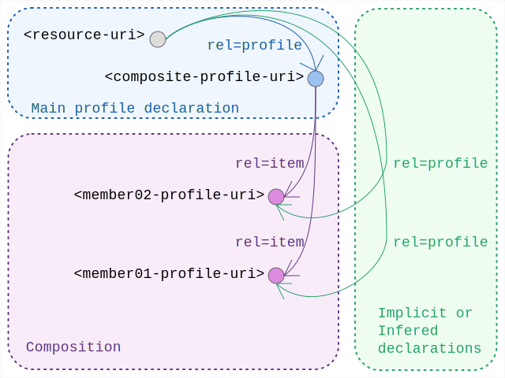

# Linkset Usage Pattern: Profile Composition

## Pattern Name

[Profile Composition][RT-P02]

## Goal

The objective of this pattern is to facilitate the granular detection of compatibility, mismatches, and instances of non-conformance within digital assets. By utilizing a recursive hierarchy of profile declarations, systems achieve "Radical Transparency," where the specific technical expectations and interoperability affordances of an asset are explicitly discoverable and machine-actionable.

## Motivation

The creation by simple declaration of new profiles is intentionally open ended and low cost. The practice encourages anyone to explicitely declare "what they actually created" as conforming to a formal design specification, even if that turns out to be a one of a kind. The concept behind radical transparency activaly encourages this "declare your own norms" aproach above the current practice to "hide all design". 

To enable this approach the [RT-P01] pattern requires nothing more than the construction of a solid profile-uri wihtin ones own domain authority, not a standardisation committee or complex governance framework.  While those obviously have their role, and are not excluded from any trustful Radical Transparency approach at all, they can be overwhelming. This perception should never become an excuse for not having actual profile declarations.

Obviously, when profiles can be created as easily as web-pages, some post-creation alignment technique is due to allow discovering equivalence or composition of profiles through some description of the relation between them.

To achieve this, the profile-composition pattern offers a clear strategy to infer interoperability declarations from encoded linkset relations between `<profile-uri>`s.


## Encoding

Profiles can express being composed of others through having `rel=item` link relations to those composing parts.  

The semantic interpretation of such composition is to read the declaration of conformance of any resource to a composing profile to include the implied declaration of conformance to the member (item) profiles it holds.

So in this pattern one would find the encoding in HTTP-headers:

```
# from the original <resource-uri> as anchor
Link: <composite-profile-uri>; rel=profile
```

and then additionally: 

```
# from the original <resource-uri> as anchor
Link: <member-01-profile-uri>; rel=profile, 
      <member02-profile-uri>; rel=profile
```

to actually mean that the original `<resource-uri>` is conforming to all of the profiles: `<composite-profile-uri>`, `<member01-profile-uri>`, and `<member02-profile-uri>`


## Sketch

  
*Sketch of the linkset-usage-pattern for profile-composition* 


## Inference Logic and Recursive Discovery

### The Inference Mechanism

Machine agents SHALL infer conformance by following a recursive discovery chain. Upon fetching an Asset URI and discovering a rel="profile" the agent MUST fetch the Profile URI. 

The agent SHALL then inspect this response on the Profile URI for 
(a) any `rel=type` to `<https://www.rfc-editor.org/info/rfc6906>` testifying of its role and purpose, 
(b) any `rel=item` link-relations it has to other profiles, and 
(c) any `rel=describedby` link-relations it declares to more semantic and tuned representations that completes the available semantic understanding of the profile.

The agent shall continue doing so recursively for the additional Profile URI it encountered in the process.

### Inference Rule Set (Conformance Detection Script)

For any combination where:

- a resource declares conformance to a profile through
  ```
  # from any <resource-uri> anchor
  Link: <profile-uri>; rel=profile
  ```
- and that profile declares composition to another profile through
  ```
  # from any <profile-uri> anchor
  Link: <2nd-profile-uri>; rel=item
  ```
- and optionally both profiles are explicitly 'typed' through
  ```
  # from both <profile-uri> <2nd-profile-uri> anchor
  Link: <https://www.rfc-editor.org/info/rfc6906>; rel=type
  ```

One can infer: 

- the actual conformance declaration for the original `<resource-uri>` to be conforming to `<2nd-profile-uri>`; not only to `<profile-uri>`


## Implementation example

The following demonstrates inspecting HTTP-headers for MarineInfo.org assets.

### Resource Inspection:

Command: 

```
curl -I https://marineinfo.org/id/dataset/90
```

Sample Header Output:

```
HTTP/1.1 200 OK
Content-Type: text/turtle; charset=UTF-8
Link: <https://marineinfo.org/profiles/dataset>; rel=profile
```


### Profile Inspection:

Command: 

```
curl -I https://marineinfo.org/profiles/dataset
```

Sample Header Output:

```
HTTP/1.1 200 OK
Content-Type: text/turtle; charset=UTF-8
Link: <https://www.rfc-editor.org/info/rfc6906>; rel=type,
      <https://marineinfo.org/profiles/dataset>; rel=describedby,
      <https://semiceu.github.io/DCAT-AP/>; rel=item
```


[RT-P01]: ./01-profile-declaration.md "Profile Declaration"
[RT-P02]: ./02-profile-composition.md "Profile Composition"