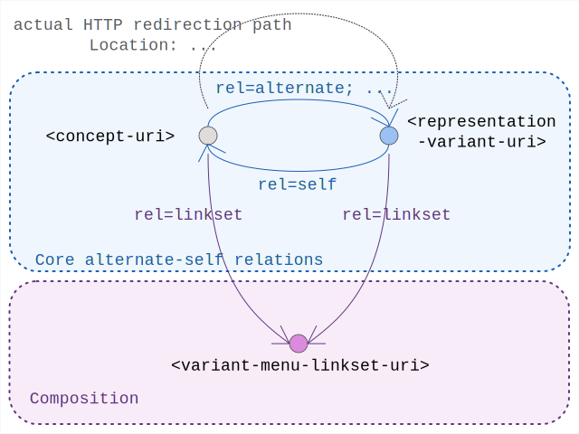

# Linkset Usage Pattern: Content Negotiation Menu

## Pattern Name

[Content Negotiation Menu][RT-P03]


## Goal

The objective of this design pattern is to resolve the mostly "hidden nature" of content-negotiation implementations on the web. 

To complement the existing practice this pattern encourages such implementations to expose the available variants and its possible interplay with redirection-practices. 


## Motivation

### Half-sided "negotiation" 

In standard HTTP content-negotiation there is actually only a very limited level of negotiation-dialogue going on. Compared to the food-ordering conversation in a restaurant which starts with asking and browsing the menu of what is available, or even be guided to suggestions by a helpful waiter, the web model more reflects the reality of ordering a drink at a noisy high throughput festival-bar: you get to shout your preferred order, but will have to content yourself with whatever you get back. 

Indeed, being confided to only one request-response cycle, the client can express its preference in HTTP-Accept headers, but still has to simply deal with how the server justifies its best offer to satisfy that. Through this linkset-pattern the service (and its both-sides negotiability) can be augmented.  By slipping in a linkset that encodes the menu-of-availaibility in the response-header a client can actively decide wheather an alternative additional request prmoises to better fit its scenario. 

### The "Broken Chain" Problem

The real world implementations of content-negotiation often rely on the 303 See Other status code to redirect a client from a Conceptual URI (the abstract identity of a resource) to a Representation URI (a specific file format like .ttl, .jsonld, or .html).

This mechanism creates a "Broken Chain" phenomenon for machine agents. Upon following the redirect, the agent arrives at a specific representation but often loses the state and context of the original Conceptual URI. Without explicit protocol-level signaling, the agent becomes "stranded" on a single variant, losing visibility of the "menu" of other available representations and the semantic metadata associated with the conceptual identity.

The Radical Transparency (RT) framework solves this by enforcing an Identity Anchor within the representation layer. By utilizing rel="self" for identity persistence. With this the server ensures that the chain of identity remains unbroken and that the full "representation menu" remains discoverable post-redirect.


## Applicability

This pattern SHOULD be applied to any resource within an interoperable data space that:

* Exposes a Conceptual URI representing a distinct entity or digital asset.
* Provides multiple representations (variants) through HTTP content negotiation.


## Encoding

To ensure machine-actionable transparency, implementations MUST adhere to a number of exposed link-relations at both the conceptual and representation levels. 

Additionally, this pattern strongly suggests to explicitely introduce the variant menu level (the linkset)
This leads to benefits for both design (overview and manageability) and operational (materialisation and cacheability) aspects of this pattern.

### Conceptual Resource Level (Identity)

When a client accesses a Conceptual URI (i.e. one supporting content-negotiation), the server MUST signal the availability of the alternative representations during the response or redirection process.

```
# from the <concept-uri>  anchor
Link: <alternate-variant1-uri>; rel=alternate; type={mime1}; language={lang1}; profile={prof1},
      <alternate-variant2-uri>; rel=alternate; type={mime2}; language={lang2}; profile={prof2},
      ...
      <alternate-variantN-uri>; rel=alternate; type={mimeN}; language={langN}; profile={profN},
```

Note: The applied parameters for the effective negotiation (by mimetype, language or profile) are to be independently provided in the link-relation


### Representation Variant Level (Content)

Every representation variant (regardless of it being arrived at through any, one, or multiple redirects) MUST include the HTTP Link headers that anchor the variant back to the resource graph:

```
# from any actual <representation-uri>  anchor
Link: <concept-uri>; rel=self
```


### Variant Menu Level (Options)

The above link-relations can reuseably be coded into a central linkset that functions as a local navigation map between all these resources. This linkset then actually materializes this "menu of variants".

In that case all uri playing a role in the pattern (i.e. the concept-resource, all representation-variants and the variant-menu) should simply refer to that available variant-menu-linkset through

```
# from any <uri> anchor in this pattern
Link: <variant-menu-lsjson-uri>; rel=linkset; type="application/linkset+json", 
      <variant-menu-lstext-uri>; rel=linkset; type="application/linkset", 
```

And additionally have it map out the relative roles and relations:

in `application/linkset+json` syntax:

```
{ "linkset":
  [
    { "anchor"   : "<concept-uri>",
      "alternate": [
        {"href"    : "<alternate-variant1-uri>",
         "type"    : "{mime1}",
         "language": "{lang1}", 
         "profile" : "{prof1}",
        },
        ... other available alternate variants described and listed here
      ]
    },
    { "anchor"   : "<alternate-variant1-uri>",
      "self"     : [ {"href": "<concept-uri>"} ]
    }, 
    .... other alternat-variant-uri listed and linked to rel=self here
  ]
}

```

in `application/linkset` syntax:

```
<concept-uri>
   ; rel="self"
   ; anchor="<alternate-variant1-uri>,
<alternate-variant1-uri>
   ; rel="alternate"
   ; type="{mime1}
   ; language="{lang1}"
   ; profile="{prof1}"
   ; anchor="<concept-uri>",

... above repeated for N variants

```

## Sketch

  
*Sketch of the linkset-usage-pattern for content-negotiation menu's* 


## Implementation Example: MarineInfo Case Study

In this scenario, a machine agent requests the identity resource for a specific marine observation.

Conceptual URI: https://marineinfo.org/id/36
Target Variant: https://marineinfo.org/id/36.html
Target Variant: https://marineinfo.org/id/36.ttl
Target Variant: https://marineinfo.org/id/36.jsonld
Variant Menu:   https://marineinfo.org/id/36-ls.json

### Conneg Request for text/turtle

The client requests the conceptual resource with a preference for turtle.
The server redirects the agent while providing the linkset context.

```
curl -I "https://marineinfo.org/id/36" -H "Accept: text/turtle"
```

```
HTTP/1.1 303 See Other
Location: https://marineinfo.org/id/36.ttl
Link: <https://marineinfo.org/id/36-ls.json>; rel="linkset"; type="application/linkset+json"
```


### Representation Delivery with Menu Provisioning

The agent fetches the Turtle representation. 
The response headers MUST restore the "Broken Chain" by providing the identity anchor and the alternate menu.

```
curl -I "https://marineinfo.org/id/36.ttl" -H "Accept: text/turtle"
```

```
HTTP/1.1 200 OK
Content-Type: text/turtle
Link: <https://marineinfo.org/id/36-ls.json>; rel="linkset"; type="application/linkset+json"
```


### Menu Delivery (Linkset retrieval)

The agent can additionally check for the availability of other variants through

```
curl -I "https://marineinfo.org/id/36-ls.json" -H "Accept: application/linkset+json"
```

```
HTTP/1.1 200 OK
Content-Type: application/linkset+json

{ "linkset":
  [
    { "anchor"   : "https://marineinfo.org/id/36",
      "alternate": [
        {"href"    : "https://marineinfo.org/id/36.ttl",
         "type"    : "text/turtle; charset=utf-8"
        },
        {"href"    : "https://marineinfo.org/id/36.jsonld",
         "type"    : "application/ld+json"
        },
        {"href"    : "https://marineinfo.org/id/36.html",
         "type"    : "text/html; charset=utf-8"
        }
      ]
    },
    { "anchor"   : "https://marineinfo.org/id/36.ttl",
      "self"     : [ {"href": "https://marineinfo.org/id/36"} ]
    }, 
    { "anchor"   : "https://marineinfo.org/id/36.jsonld",
      "self"     : [ {"href": "https://marineinfo.org/id/36"} ]
    }, 
    { "anchor"   : "https://marineinfo.org/id/36.html",
      "self"     : [ {"href": "https://marineinfo.org/id/36"} ]
    }
  ]
}
```


[RT-P01]: ./01-profile-declaration.md "Profile Declaration"
[RT-P02]: ./02-profile-composition.md "Profile Composition"
[RT-P03]: ./03-content-negotiation-menu.md "Content Negotiation Menu" 