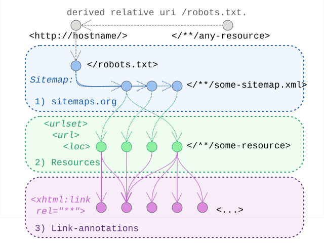

# Linkset Usage Pattern: Hostwide Resource Discovery

## Pattern Name

[Hostwide Resource Discovery][RT-P06]

## Goal

This pattern aims to provide an alternative way to discover and harvest available link-relations (possibly in linksets) on resources from a particular host. 

This allows for deployment solutions where content providers can leave static content to be served, but have no or limited control over the service stack to also influence HTTP-Header responses. Additionally it provides a catch-all starting point for cases where no single such point is naturally available. 


## Motivation

All patterns up to here work really well provided you have a URI to start with. They also assume one has enough control over the deployment environment to manipulate HTTP-headers in responses.

When one of the above is not easily met, this pattern offers to use existing web-infrastructure (namely robots.txt and sitemap.xml) to disclose relevant resources and apply classic XML-namespace syntax to mixin and annotate those links with exposed link-relations. 

## Relation to other patterns

Unlike the other patterns, this one does not really play into a specific usage scenario, concrete issue, or stereotypical resources-roles to be captured and expressed via the correct `rel=...` combinations. Instead it adds a practical implementation path to provide these link-relations and have them discovered or harvested.

[RT-P07] provides a concrete usage of these to expose catalogs on a host-level.


## Existing use and variants

The technique we describe here is borrowed from (and documented by) important other players. We have however encountered two distinct implementation alternatives.

### Google and Adobe: back to xhtml links

The first encountered technique for this relies on the inclusion of this namespace:
```
xmlns:xhtml="http://www.w3.org/1999/xhtml"
```

This approach is not a theoretical proposal but a reflection of established web-crawling practices. Large-scale publishers like Google (e.g., for Gmail sitemaps) and Adobe have long used XHTML link injections within the Sitemap protocol to signal localized variants or related resources. 

For a formal reference on the base protocol, see [Sitemaps.org][sitemaps-org].

For specific examples and documentation we refer to:
* Google's gmail sitemap: [https://www.google.com/gmail/sitemap.xml]
* Adobe's home sitemap: [https://www.adobe.com/home-sitemap.xml]
* Google's developer docs: [https://developers.google.com/search/docs/specialty/international/localized-versions#example_2]

The use of `xhtml:link` within a sitemap brings the web-linking model full circle. While RFC 8288 [RFC 8288][rfc8288] provides the formal model for externalizing links from the HTML payload into the HTTP header, it fundamentally encodes the same relationship logic originally introduced by HTML `<link>` tags. By using the xhtml namespace, we maintain a consistent serialization path: from HTML tags to XML-embedded links, all while adhering to the same semantic registry defined by IANA.


### Signposting.org: signmaps

The alternative is using this namespace:
```
xmlns:rs="http://www.openarchives.org/rs/terms/"
```

todo add refs to signmaps
todo address maybe this question: is there any justification by signposting peeps concerning this introduced new namespace?  it might have to do with the fact that rfc8288 slightly extended the model - anchor, rel, type might not be available in the xhtml xsd ?


### Howto select and embrace

Without further dialogue with signposting.org community we tend to lean towards the usage introduced by Google (as they are closer to the sitemaps.org initiative)

In alignment with Jon Postel’s Robustness Principle—"be conservative in what you do, be liberal in what you accept from others" (RFC 1122[RFC 1122][rfc1122]—we recommend that providers strictly emit the `xhtml:link` syntax to ensure maximum compatibility with existing search engine crawlers. However, consumers (machine agents) SHOULD be liberal and also accept the `rs:ln` extension as defined by the Signmap specification, as both share the same underlying goal of host-wide link exposure.

todo .. future work might investigate usage of xlink to similar effect?  

todo .. allow to reconsider the prefered choice here -- RT is in the realm of formal declarations, it might be more logical to adhere to enforcable validation trajectories (so is the rs-terms xsd more complete?)


## Encoding 

To implement this pattern, the server MUST:

1. Include the XHTML namespace declaration in the root `<urlset>` element: `xmlns:xhtml="http://www.w3.org/1999/xhtml"`.
2. Within each `<url>` block, following the mandatory `<loc>` element, include one or more `<xhtml:link>` elements.
3. Each link MUST contain a rel attribute and an href attribute pointing to the target resource (e.g., a profile or a linkset).


## Sketch

  
*Sketch of the linkset-usage-pattern for hostwide discovery of resources*


## Link Relations Used

Unlike other RT patterns, [RT-P06] does not mandate a specific set of link relations. Instead, it functions as a transport container for any relation type defined in other patterns (such as `rel="profile"` from [RT-P01] or `rel="linkset"` and `rel="variant"` from [RT-P03]).


## Implementation Example: MarineInfo 

Applying the RT-P06 pattern to marineinfo.org ....

todo think about a good one ... currently I think we could go back to one of the previous ones (e.g pattern 03? ) and translate the available links expressed there into a sitemap counterpart?


We consider for this example the functional "roles" of the various resources to be performed by the following actual URI:

| Functional role in the pattern | Actual URI in this example                                                                   |
| ------------------------------ | -------------------------------------------------------------------------------------------- | 

... 


[RFC 1122]: https://www.rfc-editor.org/info/rfc1122                             "RFC 1122 Requirements for Internet Hosts -- Communication Layers"
[RFC 8288]: https://www.rfc-editor.org/info/rfc8288                             "RFC 8288 Web Linking"
[RT-P01]: ./01-profile-declaration.md                                         "Profile Declaration"
[RT-P03]: ./03-content-negotiation-menu.md                                    "Content Negotiation Menu"
[RT-P06]: ./06-hostwide-discovery.md                                          "Hostwide Resource Discovery"
[RT-P07]: ./07-catalog-listings.md                                            "Catalog Listing"
