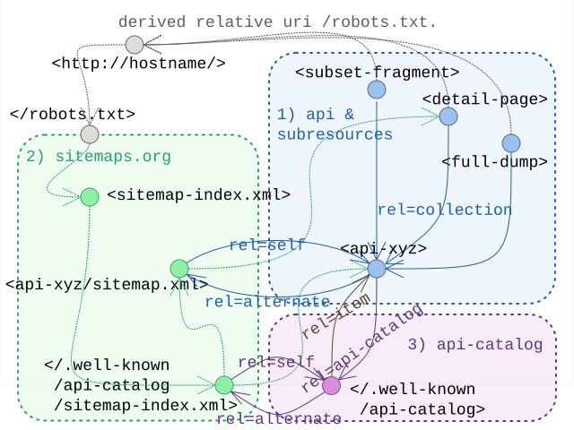

# Linkset Usage Pattern: Catalogue Assisted Resource Exposure

## Pattern Name

[Catalogue Assisted Resource Exposure][RT-P07]

## Goal

The objective of this pattern is to delegate the granular exposure and discovery of digital assets to specialized catalogs, registers, or stream-based interfaces (such as DCAT, OGC API - Records, Subsetting API services, or dedicated harvesting services). By marking these catalogs as authoritative entry points within the host-wide discovery layer (RT-P06), providers can ensure that machine agents find the most efficient path to harvest or search large-scale collections without overwhelming static sitemaps.

## Motivation

The pattern for host-wide discovery [(RT-P06)][RT-P06] offer a simple and straightforward approach to mixin link-relation annotations into sitemaps. However, real-life service deployments make us additionally consider scaling challenges, typical hierarchy of resourcetypes and varying needs or goals for crawler activities or search-engine indexing:

* Scalability Limits: The Sitemap protocol is capped at 50,000 entries per file (or 50MB per file, if the average size per entry exceeds 1KB). This is insufficient for domains hosting millions of records or dynamic subsets. The sitemap protocol offers a hierarchical index file to mediate this limit, but offers no further application advise in mapping that to the common APIs that typically assist in such large scale publication of resources.
* Search vs. Crawl: Large collections often require query-based access (e.g., spatial filters in STAC or OGC Records) rather than linear crawling.
* Bot Efficiency: Specialized catalogs provide richer metadata "hints" (profiles) that allow bots to skip irrelevant sub-collections early in the discovery process.
* The Balancing Act: This pattern allows architects to choose the "optimal bucket" for their data. If a domain lacks a Subsetting API (RT-P05), it may keep more detail in the sitemap. Conversely, the presence of a robust API-Catalog (RFC 9727) allows the sitemap to remain "lean and mean" by simply pointing to the catalog's root.


--todo: expand into prose

* make a point about both "types" of resources as well as possible hierachy of "resources" to be visited by a mix of indexing webcrawlers and dedicated harvesting tools
  * types:
    * static content - possibly in conneg (RT-PO4) setup 
    * one page UI frontends to API
    * API endpoints & catalog endpoints 
    * datasets &  catalog dumps
    * api-detail pages & catalog-entry-detail pages (both with possible conneg setup)
    * subsets & fragments
  * optimised harvesting API:
  * sitemap-index hierarchy: 
* match that to sitemap-index hierachy


## Relation to other patterns

--todo: expand into prose

* extends on [RT-P06] and offers a strategy to optimise the balance between genereal web-crawling and tuned harvesting API's
* relies on [RT-P01] to recognise certain catalogues by their profile
* connects to [RT-P05] in case the catalog wants to present itself also as a subsetting API


## Encoding 

This pattern implements the "hand-over" from the general sitemap to the specialized catalog using the ResourceSync/Signmap extension elements (`rs:ln`):
* Entry Point: The <loc> element in the sitemap points to the root URI of the catalog or the /.well-known/api-catalog.
* Relation Type rel="api-catalog": Mandated by RFC 9727 to signal that the target is a formal list of available APIs or services.
* Profile Declaration: A rel="profile" link MUST be present to inform the agent of the catalog's type (e.g., OGC Records, DCAT-AP, or LDES), enabling the agent to calibrate its harvesting strategy.

-- todo: provide encoding rules -- basically listing catalogs, preferably in a separate sitemap-index, relation to api-catalog?


## Sketch

  
*Sketch of the linkset-usage-pattern for catalog assisted discovery*


## Link Relations Used

| Relation Type | Specification | Technical Function | 
| :--- | :--- | :--- | 
| rel=api-catalog | [RFC 9727] | Identifies the resource as a formal registry of services or APIs. | 
| rel=profile | [RFC 6906] | Declares the standard the catalog adheres to (e.g., STAC, DCAT, OGC), allowing the harvester to select the correct driver. |
| rel=collection | [RFC 6573] |  As in [RT-P05] we link provided details and subsets back to the api-endpoint that produces them. | 
| rel=self | [RFC 4287] | As in [RT-P03] we link alternatives back to their core identifying resource. 
| rel=alternate | [RFC 6596]  | As in [RT-P03] we link to known alternative representations.


## Implementation Example: MarineInfo 

In this example, MarineInfo.org exposes its vast collection of records. Instead of listing every individual dataset in the main sitemap, it delegates to dedicated sub-sitemaps for the various types maintained on the system (As it proves our point we limit ourselves to expanding only one).
In the process it links to the alternative LDES harvesting protol endpoints that are provided for each of them. 
Finally these endpoints are also listed in the available api-catalog.


### Structural boilerplate

The starting point is the `/robots.txt` file

```txt 
# https://marineinfo.org/robots.txt

Sitemap: https://marineinfo.org/sitemap.xml
```

The central sitemap.xml delegates to one per type of exposed record, plus the one listing the api-catalog and ldes-api-endpoints.

```xml 
<?xml version="1.0" encoding="UTF-8"?>
<!-- https://marineinfo.org/sitemap.xml -->
<sitemapindex
    xmlns="http://www.sitemaps.org/schemas/sitemap/0.9"
    xmlns:rs="http://www.openarchives.org/rs/terms/"i
>
  <!-- First a specific sitemap works as alternate variant for the api-catalog -->
  <sitemap>
    <loc>https://marineinfo.org/.well-known/api-catalog/api-sitemap.xml</loc>
    <rs:ln rel="self" 
           href="http://marineinfo.org/.well-known/api-catalog" />
  </sitemap>
  <!-- The, for the various types: dataset, person, institute, ... we introduce sub-sitemaps 
     | These function, in turn, as alternatives for the provided (and better tuned) LDES harvesting endpoint.
     -->
  <sitemap><!-- for type dataset  -->
    <loc>https://marineinfo.org/sitemaps/dataset-sitemap.xml</loc>
    <rs:ln rel="self" 
           href="https://marineinfo.org/feed/dataset" />
    <rs:ln rel="api-catalog" 
           href="https://marineinfo.org/.well-known/api-catalog" />
  </sitemap>
  <sitemap>
    ... <!-- Repeated similarly for other types ... -->
  </sitemap>
</sitemapindex>
```

### The API-catalog 

The API-catalog lists all the known API endpoints.

```json
// https://marineinfo.org/.well-known/api-catalog
{
  "linkset": [
    {
      "anchor"   : "https://marineinfo.org/.well-know/api-catalog",
      "item"     : [ // the various different LDES feeds as api-endpoints listed:
        {"href": "https://marineinfo.org/feed/dataset"},
        {"href": "https://marineinfo.org/feed/person"},
        {"href": "https://marineinfo.org/feed/institute"},
        ... // repeated to list all feeds for the various types
      ],
      "alternate": [ // the sitemap alternative to retrieve all api-endpoints:
        {"href": "https://marineinfo.org/.well-known/api-catalog/api-sitemap.xml", 
         "type": "application/xml; profile=http://www.sitemaps.org/schemas/sitemap/0.9"}
      ] 
    }, 
    { // for each api-endpoint we can simply include its profile and descriptive links
      "anchor"   : "https://marineinfo.org/feed/dataset",
      "profile"  : [ // declare conformance of this endpoint to the LDES spec
        {"href": "https://w3id.org/ldes/specification" }
      ], 
      "alternate": [ // the sitemap alternative to retrieve all datasets:
        {"href": "https://marineinfo.org/.well-known/api-catalog/api-sitemap.xml", 
         "type": "application/xml; profile=http://www.sitemaps.org/schemas/sitemap/0.9"}
      ]
    }, 
    ... // repeated for the other types
  ]
}
```

This can mostly be repeated into the alternate variant in sitemap.xml format as a fallback to classic web-resouce harvesting.

```xml 
<!-- https://marineinfo.org/.well-known/api-catalog/api-sitemap.xml -->
<urlset 
    xmlns="http://www.sitemaps.org/schemas/sitemap/0.9"
    xmlns:rs="http://www.openarchives.org/rs/terms/"
>
  <url>
    <loc>https://marineinfo.org/feed/dataset</loc>
    <rs:ln rel="profile"
           href="https://w3id.org/ldes/specification">
  </url>
  <url>
    <loc>https://marineinfo.org/feed/person</loc>
    <rs:ln rel="profile"
           href="https://w3id.org/ldes/specification">
  </url>
  <url>
    <loc>https://marineinfo.org/feed/institute</loc>
    <rs:ln rel="profile"
           href="https://w3id.org/ldes/specification">
  </url>
  <url>
    ... <!-- Repeated similarly for other types ... -->
  </url>
<urlset>
```


### The LDES API 

Finally each API endpoint can play a similar game to 
1. use link relations to hook-up api-catalog and/or (optionally more elaborate) linksets 
2. provide a classic sitemap.xml alternate variant to harvest (some selection of) sub-resources.

For the link relation:

```bash
$ curl -LI --url "https://marineinfo.org/ldes/dataset"

HTTP/1.1 200 OK
Link: </.well-known/api-catalog>
      ; rel=api-catalog
Link: </sitemaps/dataset-sitemap.xml>
      ; rel=alternate
      ; type="application/xml; profile=http://www.sitemaps.org/schemas/sitemap/0.9"
...
```

For the sitemap alternative:
```xml
<!-- https://marineinfo.org/sitemaps/dataset-sitemap.xml -->
<urlset>
  <url><loc>https://marineinfo.org/id/dataset/1</loc></url>
  <url><loc>https://marineinfo.org/id/dataset/2</loc></url>
  <url><loc>https://marineinfo.org/id/dataset/3</loc></url>
  <url><loc>https://marineinfo.org/id/dataset/5</loc></url>
  <url>
    ... <!-- Repeated similarly for other instances of this type ... -->
  </url>
<urlset>
```


[RFC 4287]: https://www.rfc-editor.org/info/rfc4287                             "RFC 4287 The Atom Syndication Format"
[RFC 6573]: https://www.rfc-editor.org/info/rfc6573                             "RFC 6573 Item/Collection Relations"
[RFC 6596]: https://www.rfc-editor.org/info/rfc6596                             "RFC 6596 The Canonical Link Relation"
[RFC 6906]: https://www.rfc-editor.org/info/rfc6906                             "RFC 6906 The 'profile' Link Relation"
[RFC 9727]: https://www.rfc-editor.org/info/rfc9727                             "RFC 9727 api-catalog"
[RT-P01]: ./01-profile-declaration.md                                         "Profile Declaration"
[RT-P03]: ./03-content-negotiation-menu.md                                    "Content Negotiation Menu"
[RT-P05]: ./05-subsetting-api.md                                              "Subsetting API"
[RT-P06]: ./06-hostwide-discovery.md                                          "Hostwide Resource Discovery"
[RT-P07]: ./07-catalog-assistance.md                                          "Catalog Listing to Assist Hostwide Discovery"
