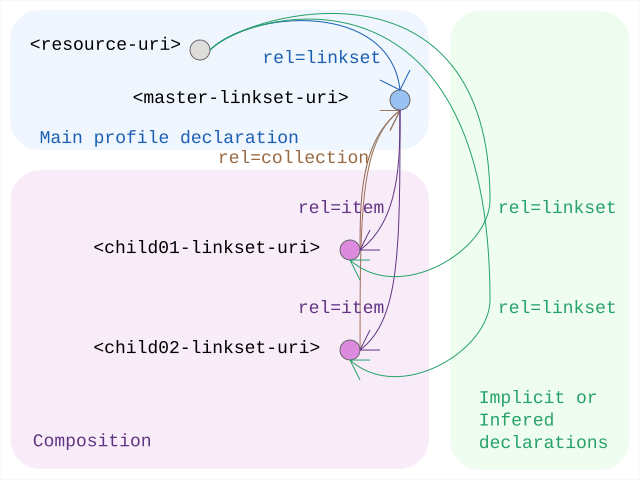

# Linkset Usage Pattern: Large Linkset Split-up

## Pattern Name

[Large Linkset Split-up][RT-P08]

## Goal

The objective of this pattern is to provide a standardized mechanism for decomposing large linksets into manageable, cacheable, and specialized fragments. By utilizing the `rel="item"` and `rel="collection"` relations, providers can split extensive discovery maps—driven by large catalogs, complex sitemaps, or the aggregation of multiple RT patterns—without losing the structural integrity of the resource’s "webmap."

## Motivation

While [RFC 9264 linksets][RFC 9264] solve the "bloated HTTP header" problem, the linkset documents themselves can become a bottleneck at scale. Key drivers for this pattern include:

* Predictability and Performance: Massive linksets (e.g., for global catalogs) can impact parser performance and memory usage on constrained machine agents.
* Cache Optimization: Splitting links by their change frequency (e.g., static profile links in one file, dynamic provenance links in another) allows for more efficient HTTP caching strategies.
* Separation of Concerns: A provider may wish to group links by their functional role (e.g., one child linkset for the Content Negotiation Menu of RT-P03 and another for the Subsetting API anchors of RT-P05). Additionally various resources might be playing different roles in different patterns: so linksets could naturally reflect individual patterns and get recombined depending on specific resources.
* Sync Efficiency: In large-scale deployments like ResourceSync or LDES, breaking down updates into smaller chunks reduces the payload size for each synchronization event.

## Relation to other patterns

This is a simple and stand-alone "architectural housekeeping" pattern. A direct application in fact of [RFC 6573], in particular to linksets [RFC 9264] themselves.

As such it simply serves as a reminder of a built-in engineering optimisation that might very well get handy, precisely when eagerly adopting 'all these patterns' and its underlying Radical Transparency idea.

## Encoding 

Decomposition follows a hierarchical structure using the Item/Collection logic ([RFC 6573]):

1. Identity Anchor: The resource itself points to a Master Linkset using rel="linkset".
2. Downlink (Decomposition): Within the Master Linkset, additional fragments are linked using rel="item".
3. Uplink (Context): Each child linkset SHOULD include a rel="collection" link back to the Master Linkset to maintain the discovery context.
4. Implicit Statement Scope: Statements within a child linkset remain autonomous. When a machine agent encounters an item relation in a linkset, it SHOULD recursively harvest the target to complete its understanding of the anchor resource.

### Design Considerations: Target Attributes 

While [RFC 8288] is open to any key/value target attributes, it is limiting in its own standard set of target attributes (e.g., type, title, media) in [its 3.4 section](https://www.rfc-editor.org/info/rfc8288/#section-3.4), Radical Transparency encourages the use of extension attributes within linksets to guide machine agents. To optimize harvesting in [RT-P08], providers SHOULD consider adding:

* `last-modified={iso 8601 datetime}`: To allow agents to skip hitting unchanged child linksets.
* `change= {created|updated|deleted}`: (Inspired by [the changeType in ResourceSync](https://www.openarchives.org/rs/1.1/resourcesync.xsd)) to signal the nature of the update within a split-up stream.

## Sketch

  
*Sketch of the linkset-usage-pattern for large-linksets*

## Link Relations Used

 | Relation Type     | Specification | Technical Function | 
 | :---------------- | :------------ | :----------------- | 
 | rel="linkset"     | [RFC 9264]    | Points the initial resource to the primary navigation map (the Master). | 
 | rel="item"        | [RFC 6573]    | Signals that the target is a constituent fragment of the linkset, triggering recursive discovery. | 
 | rel="collection"  | [RFC 6573]    | Points back from a fragment to its parent/master linkset to provide context. |

## Implementation Example

We leave this trivial example as an inviting exercise to the reader.

[RT-P08]: ./08-large-linksets.md                                              "Large Linksets"
